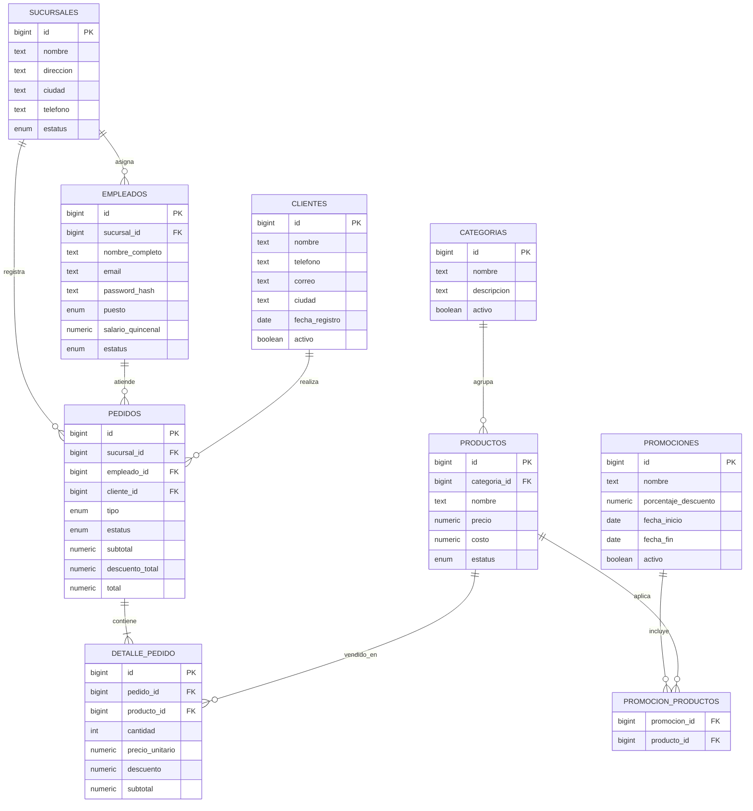

# Diagrama Entidad-Relacion

## Reglas Implementadas En La Base/API

- El precio historico se guarda en `detalle_pedido.precio_unitario`.
- Los importes usan `NUMERIC(10,2)`.
- Los pedidos no se eliminan fisicamente.
- Los catalogos usan baja logica mediante `estatus` o `activo`.
- Una sucursal no puede tener mas de un gerente activo por indice parcial.
- La API valida que no se pueda dejar una sucursal sin gerente activo.
